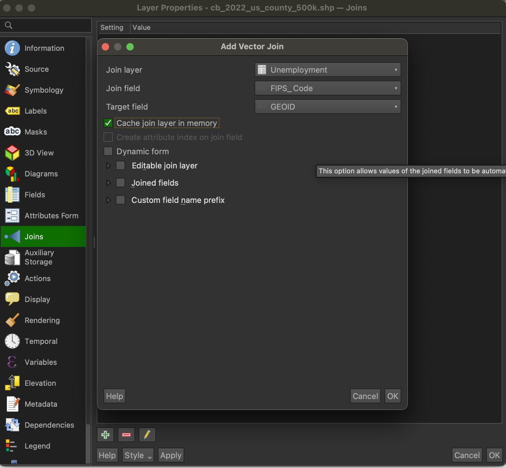
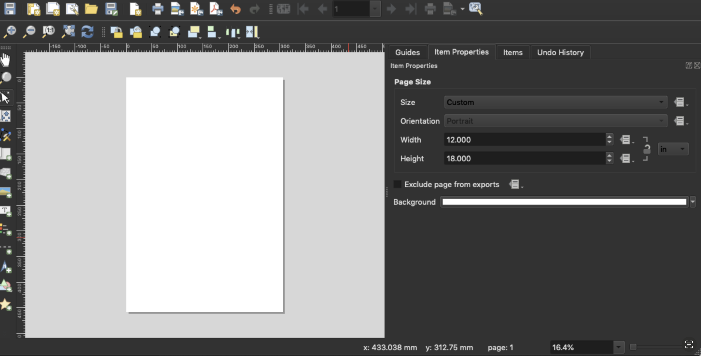

# Visualizing Unemployment Trends: A County-Level Analysis of Kentucky and Ohio

Explore the dynamic visualizations of unemployment rates in Kentucky and Ohio at the county level through these interactive maps [here](http://127.0.0.1:5500/map-options/index.html)! The first map is a zoomable map providing a detailed overview of 2022 unemployment rates in both states. Meanwhile, the second map offers insights into the evolution of unemployment rates from 2000 to 2022, allowing for a historical perspective. These maps are designed to illustrate the nuanced variations in unemployment rates across counties, shedding light on regions facing more pronounced challenges in terms of unemployment.

## Table of Contents

- [Introduction](#introduction)
- [Data Source](#data-source)
- [Mapping Unemployment Trends: A Step-by-Step Guide](#mapping-unemployment-trends-a-step-by-step-guide)
- [Creating a Zoomable Map](#creating-a-zoomable-map)
- [Creating a Comparison Map](#creating-a-comparison-map)
- [Summary](#summary)
- [Link to the Final Project](#link-to-the-final-project)

***

## Introduction

The maps were developed to visually communicate the spatial distribution of unemployment rates in Kentucky and Ohio, emphasizing variations across counties and highlighting regions facing significant challenges. The map depicting the progression of unemployment rates from 2000 to 2022 in Kentucky and Ohio can serve as a valuable tool for policymakers, businesses, and community leaders through a comparative analysis. The zoomable map, on the other hand, enhances user engagement by providing the ability to pinpoint specific counties and access their corresponding unemployment rates. Analyzing variations in unemployment rates by county is crucial for targeted policymaking, resource allocation, and community development. Firstly, visualization of county-level data helps policymakers identify regions with higher unemployment rates, enabling the implementation of targeted interventions to stimulate economic growth and job creation where needed most. Secondly, for individuals and businesses, understanding county-level variations guides strategic decisions, such as workforce mobility and location choices. Lastly, the data assists in evaluating the effectiveness of existing policies, ensuring that resources are allocated efficiently, and contributes to the overall understanding of regional economic dynamics for sustainable community development. Therefore, examining unemployment variations at the county level serves as a vital tool for fostering regional economic resilience and addressing disparities.

## Data Source

* Initial Data projection: North American Datum, 1983, ESPG: 4269.
* Final map projection: World Geodetic System, 1984, EPSG: 4326.
* State and county data: U.S. Census Bureau TIGER Lines: [County TIGER Lines](https://www2.census.gov/geo/tiger/TIGER2023/COUNTY/).
* Unemployment Rates data: U.S. Department of Agriculture: [Economic Research Service](https://www.ers.usda.gov/data-products/county-level-data-sets/county-level-data-sets-download-data/).

## Mapping Unemployment Trends: A Step-by-Step Guide

### Downloading Necessary Data

First, let's start off with downloading necessary data and join them to the county geometries. There are three datasets we will use - state and county level datasets from the [U.S. Census Bureau](https://www.census.gov/geographies/mapping-files/time-series/geo/cartographic-boundary.html) and unemployment rates from the [U.S. Department of Agriculture](https://www.ers.usda.gov/data-products/county-level-data-sets/county-level-data-sets-download-data/). On the U.S. Census Bureau webpage, download 1:500k (national) shapefiles under 'Counties' and 'States' titles. On the U.S. Department of Agriculture webpage, download 'Unemployment and median household income for the U.S., States, and counties, 2000–22' excel file. 


*Downloading state and county level data from the U.S. Census Bureau*


*Downloading Unemployment Rates data from the U.S. Department of Agriculture*

### Adding the Data as Layers on QGIS

After downloading the excel file, change the file type to csv file by 'Save a Copy' -> 'File Format' -> 'CSV UTF-8'.


*Change file type from Excel to CSV*

Open QGIS and first drag state and county data in zip files - 'cb_2022_us_state_500k.zip' and 'cb_2022_us_county_500k.zip' to layer. 
For unemployment csv file, before adding the file to the layer, notice that the column names starts on the fifth row, and every row after that is a record of each name. The data contains information such as "FIPS_Code", "State", number of employed, unemployed and unemployment rates by each year. The column of 'FIPS_Code' will come useful as we will use these codes when we join this layer to the county layer. 


*Unemployment Rate Data Features*

Go back to QGIS and select Add Layer > Add Delimited Text Layer. Next, add the CSV file

```
Unemployment.csv
```

and set 'Number of header lines to discard' under 'Record and Fields Options' as 4 as the column names starts on the fifth row. 
Please use the following settings when importing to QGIS.


*Adding CSV file as a layer*

After adding csv as a layer, we will join the unemployment CSV file with county layer. When you open the attribute table, you will notice that there is a numerical value both data shares - "FIPS_Code" from the CSV file and "GEOID" from the county layer. We will use these features to join the two layers.
First, right click on the county layer that you added, open the Layer Properties, and then select join, which is the symbol with the dot followed by a triangle.


*Accessing the Join*

Click the Plus button at the bottom of the window to initiate the join. On "Join layer", unemployment CSV file. On the "Join field", we will use FIPS_Code on CSV file. Then, on the "Target field", we will use "GEOID" from the county layer to merge the two dataset. The setting will look like the following:



*Joining Unemployment Rate layer with County layer*

After creating the join, open the attribute table to see if the unemployment rates have been successfully added to the county layer.


*Checking the attribute table for successful join*

### Symbolizing Unemployment Rate Layer

After confirming the data addition, return to the symbology tab, select "Graduated", and configure the settings in the Value field to:

 ```
to_real("Unemployment_Unemployment_rate_2022")
 ```

You are encouraged to choose any color ramp that suits your preferences — there's no obligation to use the ones demonstrated. If you append a percent sign (%) to the right of the %2 in the legend format, the legend will display a percent sign as intended. I select number of Classes as '5' for my maps. The corresponding legend breaks can be editing by double clicking on the legend label and typing in the bound that matches the new class bounds.


*Symbolizing unemployment rate layer*

### Don't forget to save the feature as GeoJSON!

Joins are not permanent by default. Therefore, you are encouraged to save the join layers to a new layer. Right-click the layer and Export > Save Feature As... to a new GeoJSON.

## Creating a Zoomable Map

To craft a dynamic, zoomable map, I leverage the 'Generate XYZ Tiles (Directory)' tool. This zoomable map will show county names as labels as users zooms in on the map. Following contents are the steps to create the map.

First, we will set county names to show up on the map. Right-click on the county layer, access Properties, and navigate to the labels section. Opt for "Rule-based labeling," and click on the plus sign to incorporate the label. The settings should resemble the following:


*Setting Rule-based labeling*

After setting the label, go to the Generate XYZ Tiles (Directory) and select the Extent > Draw on Map Canvas.


*Generate XYZ Tiles (Directory) and using Draw on Map Canvas option*

My scale was set at 1:2000000 before I drew the box over the map. After drawing the box, set minimum zoom as '4' and maximum zoom as '12'. You can select it as you prefer. Then, I set 'Output directory' as
 ```
map-options/tiles
 ```

and set 'Output html (Leaflet)' on the Leaflet.html provided through this course which is available under map-options folder here. I created a folder called 'tiles' for QGIS to add tiles of the zoomable map to this folder. Then run the program. After running it, if you go back to tiles folder, you will notice there are folders from 4 to 12, the min and max zoom level you set.
Open Visual Studio Code and select this repository folder, and edit index.html and tiles.html such as title, header, description etc. I alse added 

 ```
<iframe src="tiles.html" width="100%" height="640px"></iframe>
		<a href="tiles.html" class="linkbox">Full-screen version</a>-->
 ```
to add Full-screen version of the zoomable map on the webpage.

## Creating a Comparison Map

Next is creating a comparison map that shows unemployment rates in Kentucky and Ohio in the years 2000 and 2022. Go back to the joined unemployment rate layer, 'Symology' and use

 ```
to_real("Unemployment_Unemployment_rate_2000")
 ```

on the 'Value Field' to create Map 1 for showing unemployment rates in 2000. Then on QGIS, open Project -> New Print Layout -> Name the Layout. When you reach the layout, specify a page size to 12 inches in width and 18 inches in height, and insert the map and legend into this layout. 



*Setting the Layout format*

Make sure to lock layers and lock styles for layers so when we add the next map, the setting for this map won't be affected. Locking can be found when you click on a map, click 'Item Properties'.

Next, we will add unemployment rate in 2022. Use the following

 ```
to_real("Unemployment_Unemployment_rate_2022")
 ```

to create Map 2 for showing unemployment rates in 2022. Insert the map and add legend, description and other necessary metadata to help viewers in interpreting the map.


*Finished comparison map*

After creating the map, insert the image to the webpage by inserting

 ```
<!-- The image element uses the the 'src' property to show an image on the page. -->
						
 ```
in the index.html. Add 

 ```
	<a href='Map/unemp_ky_oh_1200dpi.jpg' class="linkbox">Higher resolution version</a>-->
 ```
below the previous code to add a link to higher resolution version. Finalize the webpage by putting tools used in this project, link to this GitHub repository and GIS mapping logo.

### Summary

The creation of these maps serves the purpose of providing a comprehensive visual representation of unemployment trends in Kentucky and Ohio. The zoomable map, generated using the 'Generate XYZ Tiles (Directory)' tool, offers an interactive experience by displaying county names as labels upon zooming. This map allows users to explore detailed unemployment data at various levels of scale.

The comparison maps, on the other hand, depict the evolution of unemployment rates from 2000 to 2022, highlighting distinctive trends between Ohio and Kentucky. Notably, Ohio's counties generally exhibit an overall decline in unemployment rates, while Kentucky's rates show a comparatively slower reduction, particularly in its eastern counties.

These maps are tools for users seeking insights into regional economic dynamics. They facilitate to help the users' understanding of unemployment variations over time and space. Policymakers, businesses, and communities can leverage these visualizations to inform decision-making, allocate resources strategically, and address specific economic challenges within the states of Kentucky and Ohio. 

## Link to the Final Project

Please view the final map onlin [here](https://Wookienoh09.github.io/visualizing-unemp-rates-in-ky-oh/).
